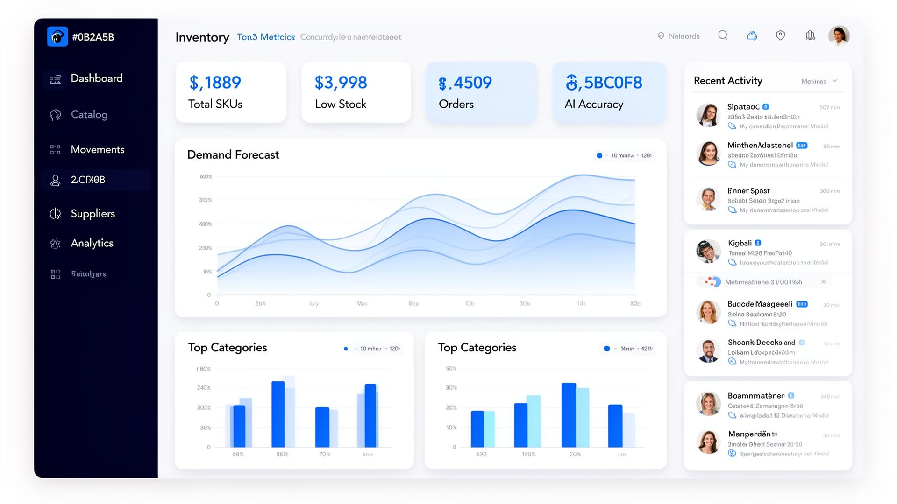

# SmartStock - Sistema de Gestão de Estoque Inteligente

## Descrição do Projeto

O SmartStock é um sistema de gerenciamento de estoque com inteligência artificial, projetado para otimizar a gestão de inventário através de previsões avançadas, alertas inteligentes e visibilidade em tempo real. Ele ajuda empresas a manterem seus estoques saudáveis, evitando rupturas e excessos, e a tomarem decisões mais informadas com base em dados.

### Funcionalidades Principais:

*   **IA Preditiva:** Previsão de demanda com modelos estatísticos que aprendem com o histórico de vendas.
*   **Alertas Inteligentes:** Receba avisos proativos antes que o estoque acabe, garantindo ruptura zero.
*   **Visibilidade em Tempo Real:** Dashboards dinâmicos para cada localização, SKU e movimentação de estoque.
*   **Fornecedores Conectados:** Gerenciamento de lead times, performance de fornecedores e integração de pedidos de compra.
*   **Leitura de Código de Barras:** Recebimento e contagem cíclica de itens em segundos via scanner ou câmera.
*   **Equipe Alinhada:** Permissões baseadas em papéis (Admin, Gestor, Solicitante) e fluxos de aprovação para otimizar a colaboração.

### Capacidades de IA:

*   **Sugestões de Reposição:** Recomendações inteligentes sobre quanto e quando comprar, calculadas por IA.
*   **Forecast Holt-Winters:** Detecção automática de sazonalidade e tendências nos padrões de demanda.
*   **Detecção de Anomalias:** Sinalização em tempo real de movimentações suspeitas no estoque.

## Tecnologias Utilizadas

O projeto SmartStock é construído com as seguintes tecnologias:

*   **Frontend:** React, Vite, TypeScript, TailwindCSS
*   **Gerenciamento de Estado/Dados:** TanStack Query, TanStack Router
*   **Componentes UI:** Radix UI, Lucide React
*   **Internacionalização:** i18next
*   **Gráficos:** Recharts
*   **Outros:** Framer Motion (animações), Zod (validação de esquemas), date-fns (manipulação de datas), file-saver, jspdf, exceljs (exportação de dados).

## Visualização do Dashboard

O dashboard do SmartStock oferece uma visão geral rápida e intuitiva do estado do seu estoque, destacando métricas importantes e áreas que precisam de atenção. Abaixo, uma prévia do dashboard:



O dashboard inclui:

*   **Métricas Chave:** Total de SKUs, itens em estoque, estoque baixo e itens sem estoque.
*   **Precisa de Atenção:** Seção que destaca itens com estoque baixo, sem estoque, pedidos de compra pendentes ou atrasados.
*   **Atividade Recente:** Um feed das últimas movimentações e eventos no estoque.
*   **Insights de IA:** Seções dedicadas a sugestões de reposição e detecção de anomalias.

## Como Começar

Para rodar o projeto localmente, siga os passos:

1.  Clone o repositório:
    ```bash
    git clone https://github.com/cody007cyberdev-blip/SmartStock.git
    cd SmartStock
    ```
2.  Instale as dependências:
    ```bash
    npm install
    # ou yarn install, pnpm install
    ```
3.  Inicie o servidor de desenvolvimento:
    ```bash
    npm run dev
    ```

O aplicativo estará disponível em `http://localhost:5173` (ou outra porta, dependendo da configuração do Vite).
